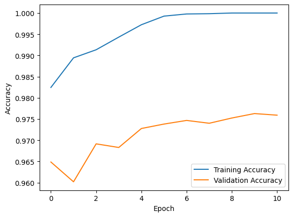
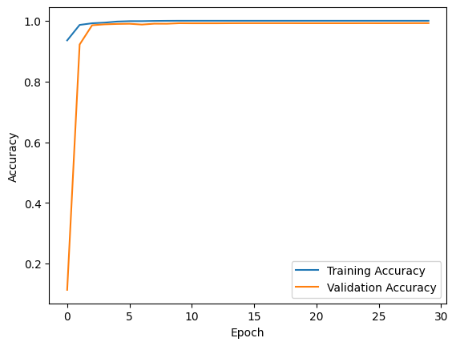

# ANN vs CNN: MNIST Digit Classification

This project compares the performance of an Artificial Neural Network (ANN) and a Convolutional Neural Network (CNN) on the MNIST digit recognition task.

## Project Overview
- **Dataset**: [MNIST Dataset](http://yann.lecun.com/exdb/mnist/)
- **ANN Accuracy**: 96.21%
- **CNN Accuracy**: 99.39%
- **Key Finding**: CNNs outperform ANNs on image-based tasks due to their ability to learn spatial hierarchies.

## Repository Structure
- `ANNDigit.ipynb`: Notebook for ANN model.
- `digitrecog.ipynb`: Notebook for CNN model.
- `results/`: Contains plots and metrics.
- `submission.csv`: Sample submission file from the CNN model.

## How to Run
1. Clone this repository:
   ```bash
   git clone https://github.com/your-username/ANN-vs-CNN-MNIST.git
   ```
2. Install the required libraries:
   ```bash
   pip install -r requirements.txt
   ```
3. Open the notebooks and run them step-by-step:
   ```bash
   jupyter notebook
   ```

## Results
| Model | Test Accuracy |
|-------|---------------|
| ANN   | 96.21%        |
| CNN   | 99.39%        |

### ANN Training and Validation Accuracy
Below is an example graph illustrating the ANN model's performance:



### CNN Training and Validation Accuracy
Below is an example graph illustrating the CNN model's performance:



## Conclusion
This project highlights the strength of CNNs for image classification tasks, demonstrating their superior performance over traditional ANNs. The results indicate that CNNs are particularly well-suited for tasks involving spatial data, such as images.

## Links
- [CNN Notebook](https://www.kaggle.com/code/asmitkumar12/digitrecog)
- [ANN Notebook](https://www.kaggle.com/code/asmitkumar12/anndigitsrcog)

---

### Future Work
1. Experiment with other architectures like ResNet or EfficientNet.
2. Fine-tune hyperparameters for both ANN and CNN to further optimize performance.
3. Explore transfer learning for improved CNN accuracy.

---
Feel free to fork, contribute, or provide feedback on this repository. Happy coding!
